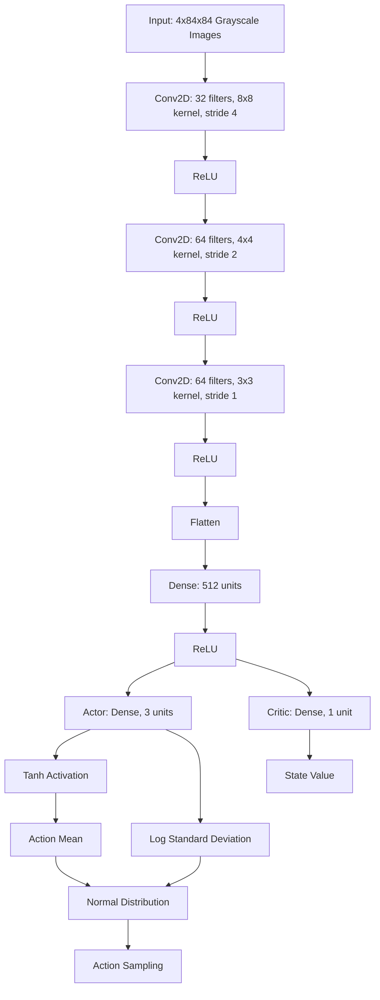
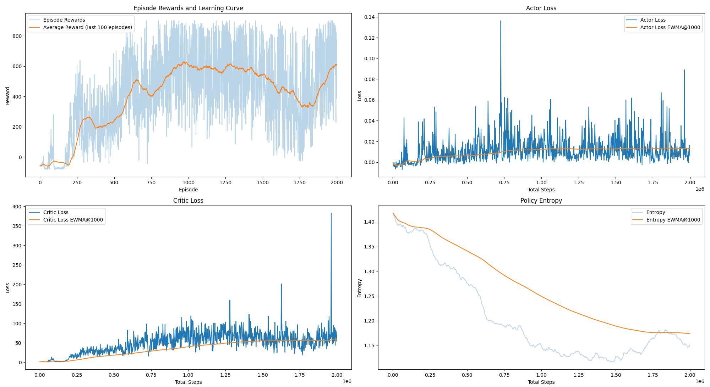

# PPO for CarRacing-v2

This project implements Proximal Policy Optimization (PPO) to solve the CarRacing-v2 environment from OpenAI Gym.

## Table of Contents
1. [Introduction](#introduction)
2. [Proximal Policy Optimization (PPO)](#proximal-policy-optimization-ppo)
3. [CarRacing-v2 Environment](#carracing-v2-environment)
4. [Implementation Details](#implementation-details)
5. [Neural Network Architecture](#neural-network-architecture)
6. [Results](#results)
7. [References](#references)

## Introduction

This project demonstrates the application of Proximal Policy Optimization (PPO), a state-of-the-art reinforcement learning algorithm, to the CarRacing-v2 environment. The goal is to train an agent to drive a car around a randomly generated track as fast as possible.

## Proximal Policy Optimization (PPO)

Proximal Policy Optimization (PPO) is an on-policy reinforcement learning algorithm developed by OpenAI. It aims to improve the stability and sample efficiency of policy gradient methods while maintaining simplicity.

Key features of PPO:

1. **Clipped Surrogate Objective**: PPO uses a clipped surrogate objective to prevent excessively large policy updates. This helps in maintaining stable learning.

2. **Actor-Critic Architecture**: The algorithm uses an actor-critic framework, where the actor determines the policy (action selection), and the critic estimates the value function.

3. **Advantage Estimation**: PPO uses Generalized Advantage Estimation (GAE) to compute advantages, balancing bias and variance in the policy gradient.

4. **Multiple Epochs**: The algorithm performs multiple optimization steps on the same batch of data, improving sample efficiency.

The PPO objective function is defined as:

$L_{\text{CLIP}}(\theta) = \mathbb{E}_t[\min(r_t(\theta) A_t, \text{clip}(r_t(\theta), 1 - \varepsilon, 1 + \varepsilon) A_t)]$

Where:\
$r_t(\theta)$ is the probability ratio between the new and old policy\
$A_t$ is the estimated advantage\
$\varepsilon$ is the clipping parameter

## CarRacing-v2 Environment

CarRacing-v2 is a continuous control task in the OpenAI Gym library. The environment features:

- **Observation Space**: RGB image of the track (96x96x3)
- **Action Space**: Continuous, 3-dimensional vector
  - Steering: [-1, 1]
  - Gas: [0, 1]
  - Braking: [0, 1]
- **Reward**: -0.1 every frame and +1000/N for every track tile visited, where N is the total number of tiles in track
- **Episode Termination**: The car goes out of the track or 1000 frames are reached

## Implementation Details

The implementation consists of several key components:

1. **Actor-Critic Network**: A shared network for both policy (actor) and value function (critic) estimation.
2. **Frame Stacking**: To capture temporal information, 4 consecutive frames are stacked and taken as input.
3. **Advantage Estimation**: Generalized Advantage Estimation (GAE) is used to compute advantages.
4. **Policy Update**: The policy is updated using the clipped PPO objective.
5. **Value Function Update**: The value function is updated to minimize the mean squared error between predicted and target values.

## Neural Network Architecture

The neural network used in this implementation is an Actor-Critic architecture:

## Results

### Training Progress

The training progress plot shows several key metrics:

1. **Episode Rewards and Average Reward**: The blue lines represent individual episode rewards, while the orange line shows the moving average over the last 100 episodes. Both demonstrate an overall increasing trend, indicating that the agent is learning to perform better over time. More training could possibly benefit the agent but in the interest of this project the obtained score and performance were adequate.

2. **Actor Loss**: Contrary to initial expectations, the actor loss shows an overall increasing trend with significant fluctuations. This could be due to:
   - The agent encountering more complex scenarios as it improves, requiring larger policy adjustments. As the agent begins navigating the racetrack it will encounter sharp turns and more complex layouts. In the first stages the agent simply learns to stay on the road itself and later it begins encountering turns which require much more complex actions to maintain the course.
   - The PPO clipping mechanism consistently triggering, affecting the reported loss. As the policy improves, the ratio $r_t(\theta)$ may frequently hit the clipping thresholds (1 - ε and 1 + ε). When this happens, the gradient of the objective with respect to the policy parameters becomes zero, effectively stopping the policy update in that direction. This clipping can lead to a plateau or even an increase in the reported loss, even though the policy is still improving in terms of achieved rewards.
   - Increasing advantage estimates as the agent achieves higher rewards.
   While concerning, it's important to note that in PPO, increasing actor loss doesn't necessarily indicate poor performance, especially if rewards are improving.

3. **Critic Loss**: The critic loss also shows an increasing trend with high volatility. This suggests that the value function estimation becomes more challenging as the agent explores higher-reward strategies. The spikes in critic loss could indicate moments of significant policy improvement or exploration of new state spaces.

4. **Policy Entropy**: The entropy of the policy decreases over time, indicating that the agent's actions become more deterministic as it learns. The gradual decrease suggests a good balance between exploration and exploitation.

### Interpretation and Potential Improvements

While the agent shows clear signs of learning, as evidenced by the increasing reward trends, there are several areas that could potentially be improved:

1. **Hyperparameter Tuning**: The increasing loss trends suggest that hyperparameters like learning rate, clipping parameter, and entropy coefficient might need adjustment.

2. **Network Architecture**: Given the complex dynamics of CarRacing-v2, experimenting with different network architectures could potentially yield better results.

3. **Extended Training**: The slowing rate of improvement in the latter stages suggests that extended training might lead to further performance gains.

4. **Training Stability**: Implementing additional PPO enhancements or exploring alternative algorithms like SAC or TD3 could potentially improve training stability and efficiency.

Despite these potential areas for improvement, the current implementation demonstrates successful learning in the CarRacing-v2 environment.

### Trained Agent Performance

You can view the performance of the trained agent in the following video:

## References
This was a project started during the Udemy course:
1. Artificial Intelligence A-Z 2024: Build 7 AI + LLM & ChatGPT 
   - Created by Hadelin de Ponteves, Kirill Eremenko, SuperDataScience Team, Luka Anicin and the Ligency Team
   - https://www.udemy.com/share/101Wpy3@8EUG1WmSHuIQ8NJ8MqbUIKERQL-i115amp8Wv-vEns_QefgYHXhNbCiRxagVIsqkvA==/

2. OpenAI Gym. CarRacing-v2. https://gymnasium.farama.org/environments/box2d/car_racing/
